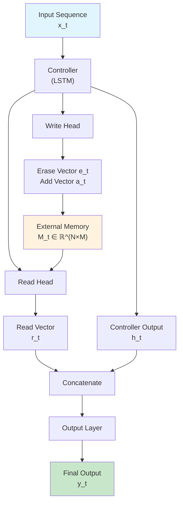
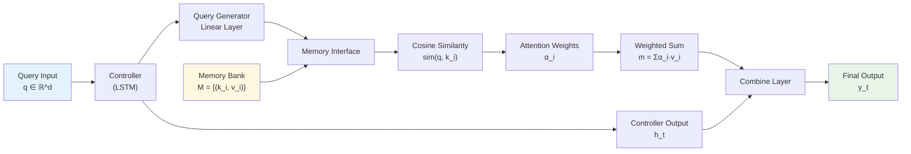
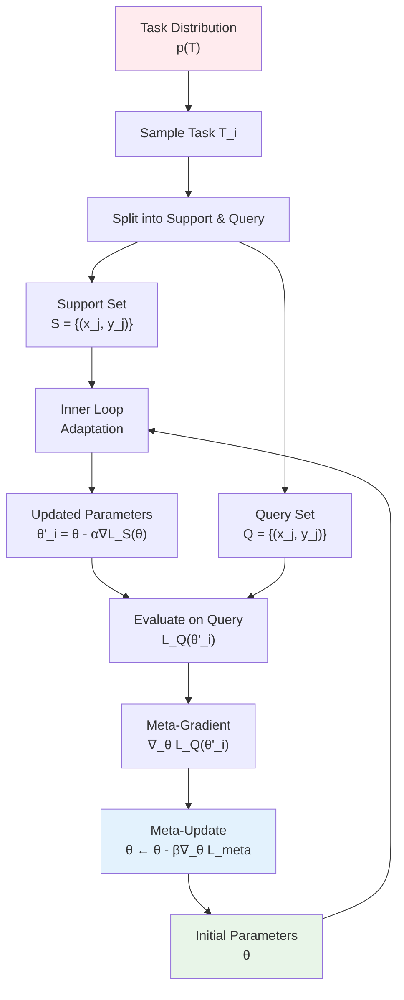
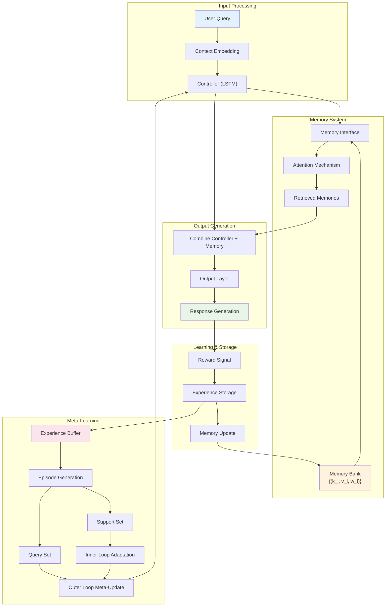

# Kiến Trúc Meta-Learning với Episodic Memory

## Tổng Quan

Hệ thống meta-learning này được thiết kế để học cách học từ kinh nghiệm trước đó thông qua episodic memory. Hệ thống kết hợp Neural Turing Machine (NTM), Memory-Augmented Neural Network (MANN), và meta-learning để tạo ra một chatbot có khả năng thích ứng nhanh chóng.

## 1. Neural Turing Machine (NTM)

### 1.1. Công Thức Toán Học

NTM sử dụng external memory $M_t \in \mathbb{R}^{N \times M}$ với $N$ memory slots và $M$ memory dimensions.

#### Read Operation:
$$r_t = \sum_{i=1}^{N} w_t^r(i) \cdot M_t(i)$$

Trong đó:
- $w_t^r(i)$ là read weight tại vị trí $i$ và thời điểm $t$
- $M_t(i)$ là memory vector tại slot $i$

#### Write Operation:
$$M_t(i) = M_{t-1}(i) \cdot [1 - w_t^w(i) \cdot e_t] + w_t^w(i) \cdot a_t$$

Trong đó:
- $w_t^w(i)$ là write weight
- $e_t$ là erase vector
- $a_t$ là add vector

#### Attention Mechanism:
$$w_t^c(i) = \frac{\exp(\beta_t \cdot \text{cosine}(k_t, M_{t-1}(i)))}{\sum_{j=1}^{N} \exp(\beta_t \cdot \text{cosine}(k_t, M_{t-1}(j)))}$$

### 1.2. Sơ Đồ Kiến Trúc NTM



## 2. Memory-Augmented Neural Network (MANN)

### 2.1. Công Thức Toán Học

MANN sử dụng memory bank $\mathcal{M} = \{(k_i, v_i)\}_{i=1}^{N}$ với key-value pairs.

#### Memory Retrieval:
$$\text{sim}(q, k_i) = \frac{q \cdot k_i}{||q||_2 \cdot ||k_i||_2}$$

#### Attention Weights:
$$\alpha_i = \frac{\exp(\text{sim}(q, k_i) \cdot w_i)}{\sum_{j=1}^{N} \exp(\text{sim}(q, k_j) \cdot w_j)}$$

Trong đó $w_i$ là importance weight.

#### Retrieved Memory:
$$m = \sum_{i=1}^{K} \alpha_i \cdot v_i$$

### 2.2. Sơ Đồ MANN



## 3. Meta-Learning Framework (MAML-inspired)

### 3.1. Công Thức Toán Học

Meta-learning sử dụng Model-Agnostic Meta-Learning (MAML) approach.

#### Inner Loop (Task Adaptation):
$$\theta_i' = \theta - \alpha \nabla_{\theta} \mathcal{L}_{\mathcal{T}_i}(f_{\theta})$$

Trong đó:
- $\theta$ là parameters ban đầu
- $\alpha$ là inner learning rate
- $\mathcal{L}_{\mathcal{T}_i}$ là loss function cho task $i$

#### Outer Loop (Meta-Update):
$$\theta \leftarrow \theta - \beta \nabla_{\theta} \sum_{\mathcal{T}_i \sim p(\mathcal{T})} \mathcal{L}_{\mathcal{T}_i}(f_{\theta_i'})$$

Trong đó:
- $\beta$ là meta learning rate
- $p(\mathcal{T})$ là distribution over tasks

### 3.2. Episodic Training Process

Mỗi episode bao gồm:
1. **Support Set** $\mathcal{S} = \{(x_j, y_j)\}_{j=1}^{K}$
2. **Query Set** $\mathcal{Q} = \{(x_j, y_j)\}_{j=1}^{L}$

#### Meta-Loss Function:
$$\mathcal{L}_{meta}(\theta) = \mathbb{E}_{\mathcal{T} \sim p(\mathcal{T})} \left[ \mathcal{L}_{\mathcal{T}}(f_{\theta - \alpha \nabla_{\theta} \mathcal{L}_{\mathcal{T}}(f_{\theta})}) \right]$$

### 3.3. Sơ Đồ Meta-Learning Process



## 4. Tích Hợp Hệ Thống Hoàn Chỉnh

### 4.1. Kiến Trúc Tổng Thể

Hệ thống kết hợp tất cả các thành phần trong `MetaLearningEpisodicSystem`:

1. **MANN** với external memory cho episodic storage
2. **NTM-inspired** attention mechanism
3. **MAML-based** meta-learning
4. **Experience replay** buffer

### 4.2. Sơ Đồ Tổng Thể



## 5. Các Thành Phần Chính và Ý Nghĩa

### 5.1. MemoryBankEntry

Mỗi entry trong memory bank chứa:

```python
@dataclass
class MemoryBankEntry:
    key: torch.Tensor      # Vector đại diện cho context
    value: torch.Tensor    # Vector chứa thông tin response
    usage_count: int       # Số lần được sử dụng
    last_accessed: int     # Thời điểm cuối được truy cập
    importance_weight: float # Trọng số quan trọng (dựa trên reward)
```

#### Công Thức Cập Nhật Importance Weight:
$$w_i = \max(0.1, \min(2.0, 1.0 + r_i))$$

Trong đó $r_i$ là reward của experience.

### 5.2. Memory Retrieval Process

#### Bước 1: Tính Similarity
$$\text{sim}(q, k_i) = \frac{q \cdot k_i}{||q||_2 \cdot ||k_i||_2}$$

#### Bước 2: Weighted Similarity
$$\text{wsim}_i = \text{sim}(q, k_i) \times w_i$$

#### Bước 3: Top-K Selection
$$\text{TopK} = \arg\max_{i_1, ..., i_K} \{\text{wsim}_{i_1}, ..., \text{wsim}_{i_K}\}$$

#### Bước 4: Attention và Combination
$$\alpha_j = \frac{\exp(\text{wsim}_{i_j})}{\sum_{k=1}^{K} \exp(\text{wsim}_{i_k})}$$

$$m = \sum_{j=1}^{K} \alpha_j \cdot v_{i_j}$$

### 5.3. Meta-Learning Training Loop

#### Thuật Toán MAML cho Chatbot:

```
Input: Distribution over conversation tasks p(T)
Input: Step sizes α, β

1. Randomly initialize θ
2. while not converged do:
3.    Sample batch of tasks T_i ~ p(T)
4.    for all T_i do:
5.       # Inner loop
6.       Sample support set S_i from T_i
7.       Compute θ'_i = θ - α∇_θ L_{T_i}(f_θ, S_i)
8.       
9.       # Evaluate on query set
10.      Sample query set Q_i from T_i
11.      Compute L_{T_i}(f_{θ'_i}, Q_i)
12.   end for
13.   
14.   # Outer loop meta-update
15.   θ ← θ - β∇_θ Σ_i L_{T_i}(f_{θ'_i}, Q_i)
16. end while
```

## 6. Ưu Điểm và Ứng Dụng

### 6.1. Ưu Điểm

1. **Fast Adaptation**: Meta-learning cho phép thích ứng nhanh với few-shot examples
2. **Episodic Memory**: Lưu trữ và tái sử dụng kinh nghiệm có liên quan
3. **Scalable**: Memory bank có thể mở rộng theo thời gian
4. **Contextual**: Attention mechanism chọn memories phù hợp với context

### 6.2. Ứng Dụng trong Chatbot

1. **Personalization**: Học preferences của user qua các cuộc hội thoại
2. **Domain Adaptation**: Nhanh chóng thích ứng với domain mới
3. **Few-shot Learning**: Học từ ít examples trong conversation
4. **Long-term Memory**: Nhớ thông tin quan trọng qua nhiều sessions

### 6.3. Metrics Đánh Giá

#### Meta-Learning Performance:
$$\text{Adaptation Speed} = \frac{1}{N} \sum_{i=1}^{N} \frac{L_0 - L_K}{L_0}$$

Trong đó:
- $L_0$ là initial loss trên task mới
- $L_K$ là loss sau $K$ adaptation steps

#### Memory Utilization:
$$\text{Memory Utilization} = \frac{\text{Active Memories}}{\text{Total Memory Slots}}$$

#### Retrieval Accuracy:
$$\text{Retrieval Acc} = \frac{\text{Relevant Retrieved}}{\text{Total Retrieved}}$$

## 7. Kết Luận

Hệ thống meta-learning với episodic memory này tạo ra một chatbot có khả năng:

1. **Học nhanh** từ ít dữ liệu
2. **Nhớ lâu** thông qua external memory
3. **Thích ứng** với context và user preferences
4. **Cải thiện** liên tục qua meta-learning

Kiến trúc này đặc biệt phù hợp cho ứng dụng chatbot cần personalization và khả năng học từ tương tác với user.

