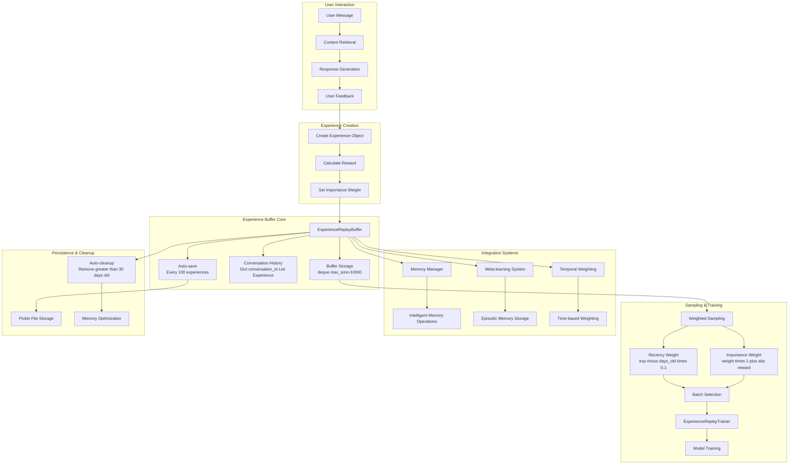
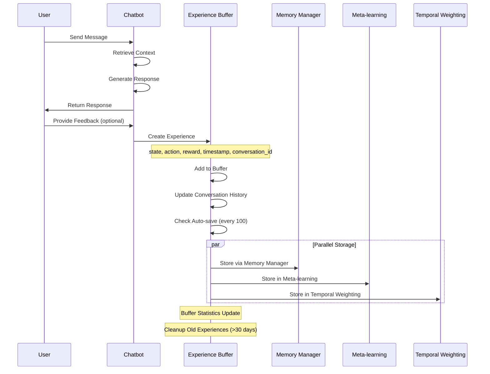
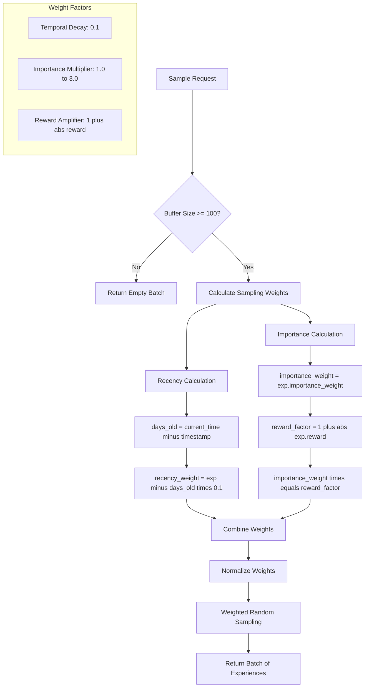
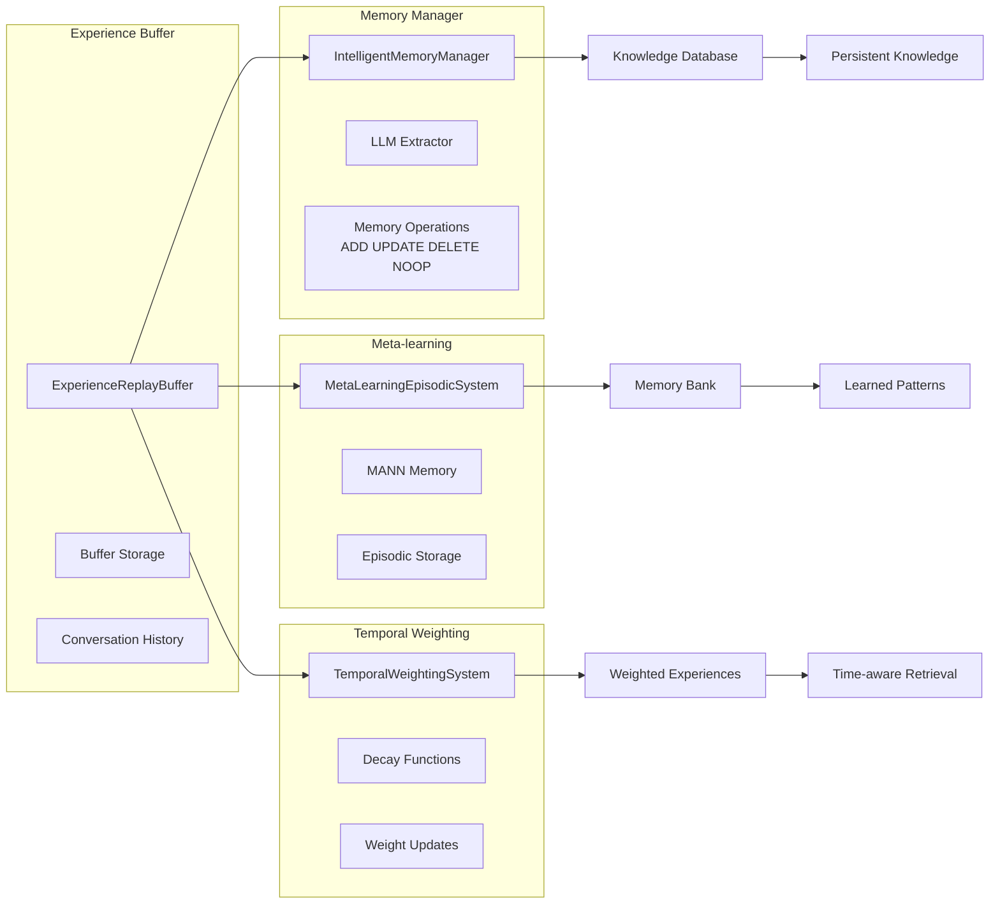
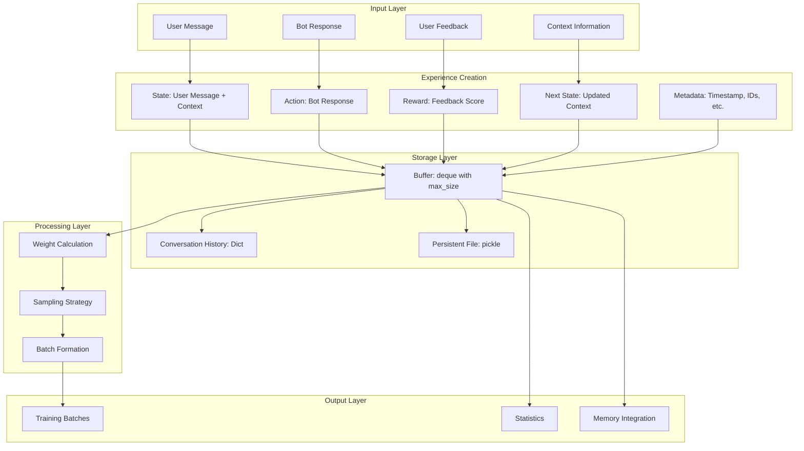
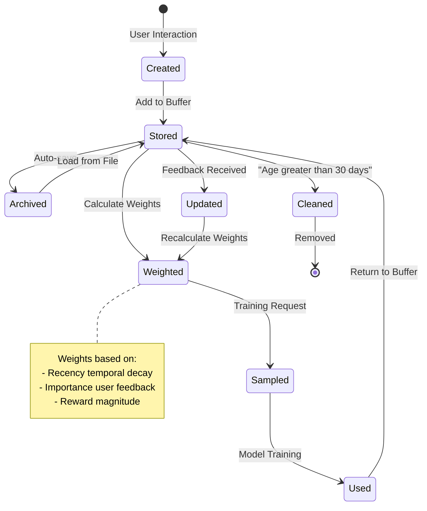
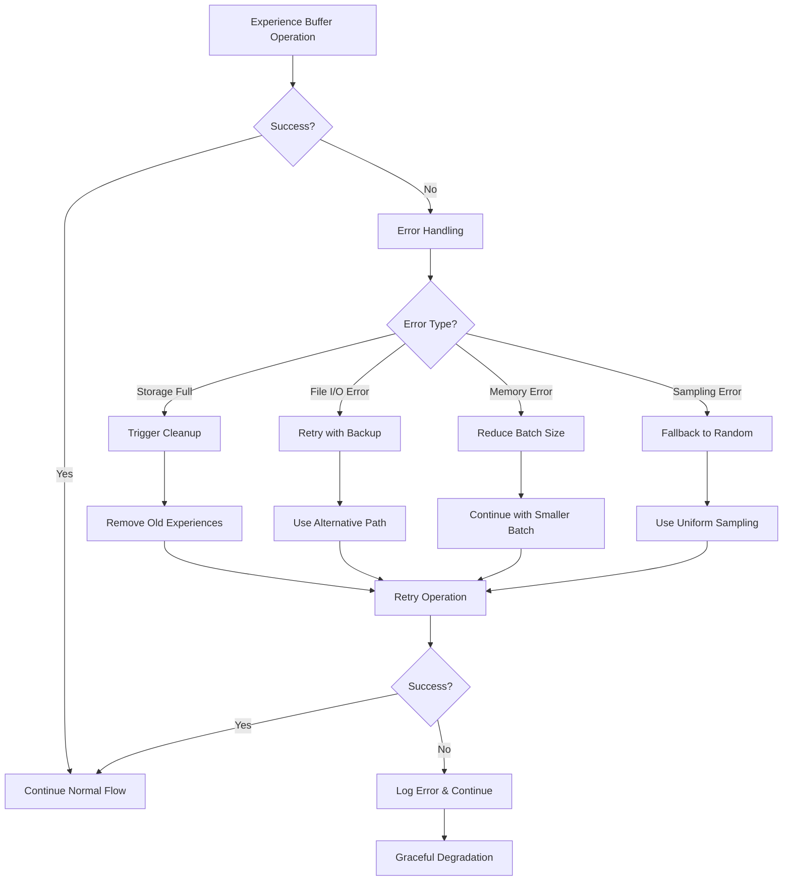

# Sơ đồ Experience Buffer Mechanism

## 1. Kiến trúc tổng thể Experience Buffer

## 2. Luồng xử lý Experience

## 3. Cơ chế Sampling Strategy

## 4. Tích hợp với Memory Systems

## 5. Data Flow trong Experience Buffer

## 6. Performance Metrics và Monitoring

```mermaid
graph TB
    subgraph "Buffer Statistics"
        A[Total Experiences]
        B["Buffer Utilization %"]
        C[Average Reward]
        D["Positive Negative Neutral Count"]
    end
    
    subgraph "Conversation Metrics"
        E[Total Conversations]
        F[Experiences per Conversation]
        G[Conversation Length Distribution]
    end
    
    subgraph "Sampling Metrics"
        H[Sampling Efficiency]
        I[Weight Distribution]
        J[Batch Quality Score]
    end
    
    subgraph "Integration Metrics"
        K[Memory Manager Operations]
        L[Meta-learning Storage]
        M[Temporal Weighting Updates]
    end
    
    A --> N[Performance Dashboard]
    B --> N
    C --> N
    D --> N
    E --> N
    F --> N
    G --> N
    H --> N
    I --> N
    J --> N
    K --> N
    L --> N
    M --> N
```

## 7. Lifecycle của Experience

## 8. Error Handling và Recovery

Những sơ đồ này minh họa toàn bộ cơ chế hoạt động của Experience Buffer, từ việc tạo experience, lưu trữ, sampling, đến tích hợp với các hệ thống memory khác trong chatbot RL.
