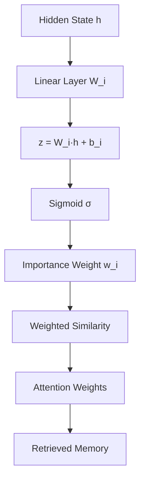

Tôi sẽ biểu diễn toán học cho `importance_generator` và toàn bộ quá trình tạo trọng số quan trọng trong hệ thống MANN.

## Biểu diễn toán học của Importance Weight Generator

### 1. Importance Weight Generator

```python
self.importance_generator = nn.Linear(hidden_size, 1)
```

**Biểu diễn toán học:**

$$\text{importance\_weight} = \sigma(W_i \cdot h + b_i)$$

Trong đó:
- $h \in \mathbb{R}^{d_h}$: hidden state vector (d_h = hidden_size)
- $W_i \in \mathbb{R}^{1 \times d_h}$: weight matrix của importance generator
- $b_i \in \mathbb{R}$: bias term
- $\sigma(\cdot)$: sigmoid activation function
- $\text{importance\_weight} \in [0, 1]$: trọng số quan trọng

### 2. Quá trình tạo trọng số trong MemoryInterface

**Input:** Hidden state $h \in \mathbb{R}^{d_h}$

**Step 1:** Linear transformation
$$z = W_i \cdot h + b_i$$

**Step 2:** Sigmoid activation
$$\text{importance\_weight} = \sigma(z) = \frac{1}{1 + e^{-z}}$$

### 3. Sử dụng trong Memory Retrieval

Khi retrieve memories, trọng số quan trọng được sử dụng để tính toán weighted similarities:

**Cosine similarity:**
$$\text{sim}(q, k_i) = \frac{q \cdot k_i}{||q||_2 \cdot ||k_i||_2}$$

**Weighted similarity:**
$$\text{weighted\_sim}(q, k_i) = \text{sim}(q, k_i) \times w_i$$

Trong đó:
- $q$: query vector
- $k_i$: key vector của memory thứ i
- $w_i$: importance weight của memory thứ i

### 4. Attention Weights

**Top-k selection:**
$$\text{top\_indices} = \arg\max_{i \in [1, N]} \text{weighted\_sim}(q, k_i)$$

**Attention weights:**
$$\alpha_i = \frac{\exp(\text{weighted\_sim}(q, k_{i}))}{\sum_{j \in \text{top\_k}} \exp(\text{weighted\_sim}(q, k_{j}))}$$

**Retrieved memory:**
$$m_{\text{retrieved}} = \sum_{i \in \text{top\_k}} \alpha_i \cdot v_i$$

### 5. Memory Management

**Score để xóa memory:**
$$\text{score}_i = \frac{w_i}{1 + \text{usage\_count}_i}$$

**Memory được xóa:**
$$i^* = \arg\min_{i} \text{score}_i$$

### 6. Gradient Flow

**Loss function cho importance learning:**
$$\mathcal{L}_{\text{importance}} = \sum_{i} \text{importance\_weight}_i \cdot \text{retrieval\_loss}_i$$

**Gradient:**
$$\frac{\partial \mathcal{L}}{\partial W_i} = \sum_{i} \frac{\partial \mathcal{L}}{\partial \text{importance\_weight}_i} \cdot \frac{\partial \text{importance\_weight}_i}{\partial W_i}$$

$$\frac{\partial \text{importance\_weight}_i}{\partial W_i} = \sigma'(z_i) \cdot h_i$$

### 7. Tổng quan kiến trúc



### 8. Ý nghĩa toán học

- **Importance weight** đóng vai trò như một **gate mechanism** để điều chỉnh mức độ quan trọng của từng memory
- **Sigmoid function** đảm bảo trọng số nằm trong khoảng [0,1], tạo ra sự ổn định trong training
- **Weighted similarity** kết hợp cả **semantic similarity** và **importance** để quyết định memory nào được retrieve
- **Attention mechanism** sử dụng weighted similarities để tạo ra weighted sum của values

Đây là một thiết kế toán học tinh tế giúp MANN có thể học cách ưu tiên và quản lý memory một cách thông minh.