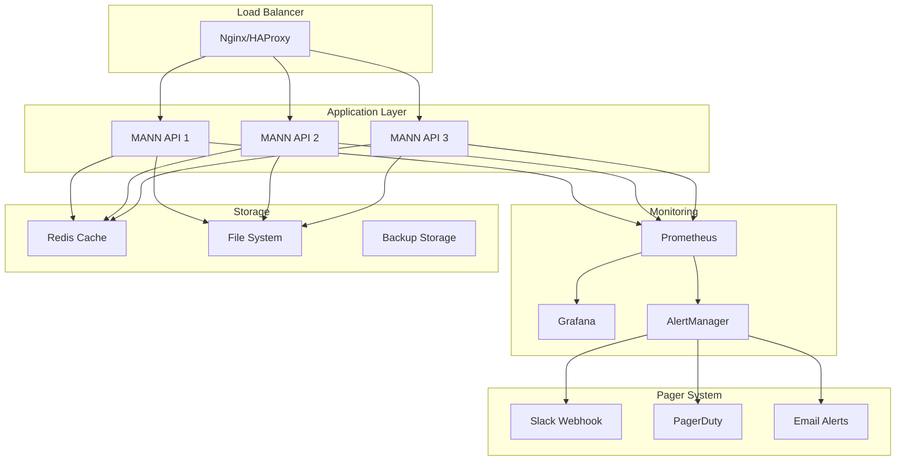

# MANN CLI Chatbot - Production Deployment Guide

Hướng dẫn triển khai MANN CLI Chatbot trong môi trường production với monitoring, pager system và best practices.

## 🏗️ Architecture Overview



## 🚀 Deployment Options

### 1. Docker Deployment

#### Single Container
```bash
# Build image
docker build -t mann-chatbot .

# Run container
docker run -d \
  --name mann-api \
  -p 8000:8000 \
  -e MANN_API_HOST=0.0.0.0 \
  -e MANN_ENABLE_PAGER=true \
  -e MANN_PAGER_WEBHOOK=https://hooks.slack.com/services/YOUR/WEBHOOK \
  -v $(pwd)/data:/app/data \
  -v $(pwd)/logs:/app/logs \
  mann-chatbot
```

#### Docker Compose
```bash
# Start all services
docker-compose up -d

# Scale API instances
docker-compose up -d --scale mann-api=3

# View logs
docker-compose logs -f mann-api
```

### 2. Kubernetes Deployment

#### Deployment YAML
```yaml
apiVersion: apps/v1
kind: Deployment
metadata:
  name: mann-api
  labels:
    app: mann-api
spec:
  replicas: 3
  selector:
    matchLabels:
      app: mann-api
  template:
    metadata:
      labels:
        app: mann-api
    spec:
      containers:
      - name: mann-api
        image: mann-chatbot:latest
        ports:
        - containerPort: 8000
        env:
        - name: MANN_API_HOST
          value: "0.0.0.0"
        - name: MANN_ENABLE_PAGER
          value: "true"
        - name: MANN_PAGER_WEBHOOK
          valueFrom:
            secretKeyRef:
              name: mann-secrets
              key: pager-webhook
        resources:
          requests:
            memory: "512Mi"
            cpu: "250m"
          limits:
            memory: "1Gi"
            cpu: "500m"
        livenessProbe:
          httpGet:
            path: /health
            port: 8000
          initialDelaySeconds: 30
          periodSeconds: 10
        readinessProbe:
          httpGet:
            path: /health
            port: 8000
          initialDelaySeconds: 5
          periodSeconds: 5
        volumeMounts:
        - name: data-volume
          mountPath: /app/data
        - name: logs-volume
          mountPath: /app/logs
      volumes:
      - name: data-volume
        persistentVolumeClaim:
          claimName: mann-data-pvc
      - name: logs-volume
        emptyDir: {}
```

#### Service YAML
```yaml
apiVersion: v1
kind: Service
metadata:
  name: mann-api-service
spec:
  selector:
    app: mann-api
  ports:
  - protocol: TCP
    port: 80
    targetPort: 8000
  type: LoadBalancer
```

### 3. Traditional Server Deployment

#### Systemd Service
```ini
[Unit]
Description=MANN API Server
After=network.target

[Service]
Type=simple
User=mann
Group=mann
WorkingDirectory=/opt/mann
ExecStart=/opt/mann/venv/bin/python run_api.py
Restart=always
RestartSec=10
Environment=MANN_API_HOST=0.0.0.0
Environment=MANN_ENABLE_PAGER=true
Environment=MANN_PAGER_WEBHOOK=https://hooks.slack.com/services/YOUR/WEBHOOK

[Install]
WantedBy=multi-user.target
```

#### Nginx Configuration
```nginx
upstream mann_backend {
    server 127.0.0.1:8000;
    server 127.0.0.1:8001;
    server 127.0.0.1:8002;
}

server {
    listen 80;
    server_name your-domain.com;

    location / {
        proxy_pass http://mann_backend;
        proxy_set_header Host $host;
        proxy_set_header X-Real-IP $remote_addr;
        proxy_set_header X-Forwarded-For $proxy_add_x_forwarded_for;
        proxy_set_header X-Forwarded-Proto $scheme;
        
        # Timeouts
        proxy_connect_timeout 30s;
        proxy_send_timeout 30s;
        proxy_read_timeout 30s;
    }

    location /health {
        proxy_pass http://mann_backend/health;
        access_log off;
    }
}
```

## 📊 Monitoring Setup

### 1. Prometheus Configuration

```yaml
# prometheus.yml
global:
  scrape_interval: 15s

scrape_configs:
  - job_name: 'mann-api'
    static_configs:
      - targets: ['localhost:8000']
    metrics_path: /metrics
    scrape_interval: 5s
```

### 2. Grafana Dashboard

```json
{
  "dashboard": {
    "title": "MANN API Dashboard",
    "panels": [
      {
        "title": "Request Rate",
        "type": "graph",
        "targets": [
          {
            "expr": "rate(http_requests_total[5m])",
            "legendFormat": "{{instance}}"
          }
        ]
      },
      {
        "title": "Memory Utilization",
        "type": "graph",
        "targets": [
          {
            "expr": "mann_memory_utilization",
            "legendFormat": "Memory Usage"
          }
        ]
      },
      {
        "title": "Response Time",
        "type": "graph",
        "targets": [
          {
            "expr": "histogram_quantile(0.95, rate(http_request_duration_seconds_bucket[5m]))",
            "legendFormat": "95th percentile"
          }
        ]
      }
    ]
  }
}
```

### 3. Alert Rules

```yaml
# alert_rules.yml
groups:
- name: mann_alerts
  rules:
  - alert: HighMemoryUtilization
    expr: mann_memory_utilization > 0.9
    for: 2m
    labels:
      severity: warning
    annotations:
      summary: "High memory utilization detected"
      description: "MANN API memory utilization is {{ $value }}"

  - alert: HighResponseTime
    expr: histogram_quantile(0.95, rate(http_request_duration_seconds_bucket[5m])) > 1
    for: 1m
    labels:
      severity: critical
    annotations:
      summary: "High response time detected"
      description: "95th percentile response time is {{ $value }}s"

  - alert: APIDown
    expr: up{job="mann-api"} == 0
    for: 30s
    labels:
      severity: critical
    annotations:
      summary: "MANN API is down"
      description: "MANN API instance {{ $labels.instance }} is down"
```

## 📱 Pager System Integration

### 1. Slack Integration

```python
# slack_pager.py
import requests
import json
from datetime import datetime

class SlackPager:
    def __init__(self, webhook_url):
        self.webhook_url = webhook_url
    
    def send_alert(self, alert_level, message, metadata=None):
        color_map = {
            "info": "#36a64f",
            "warning": "#ff9500", 
            "error": "#ff0000",
            "critical": "#8b0000"
        }
        
        payload = {
            "attachments": [
                {
                    "color": color_map.get(alert_level, "#36a64f"),
                    "title": f"MANN Alert - {alert_level.upper()}",
                    "text": message,
                    "fields": [
                        {
                            "title": "Timestamp",
                            "value": datetime.now().isoformat(),
                            "short": True
                        },
                        {
                            "title": "Service",
                            "value": "MANN API",
                            "short": True
                        }
                    ]
                }
            ]
        }
        
        if metadata:
            for key, value in metadata.items():
                payload["attachments"][0]["fields"].append({
                    "title": key,
                    "value": str(value),
                    "short": True
                })
        
        requests.post(self.webhook_url, json=payload)
```

### 2. PagerDuty Integration

```python
# pagerduty_integration.py
import requests
import json

class PagerDutyIntegration:
    def __init__(self, integration_key):
        self.integration_key = integration_key
        self.api_url = "https://events.pagerduty.com/v2/enqueue"
    
    def send_alert(self, severity, message, metadata=None):
        payload = {
            "routing_key": self.integration_key,
            "event_action": "trigger",
            "payload": {
                "summary": message,
                "severity": severity,
                "source": "MANN API",
                "custom_details": metadata or {}
            }
        }
        
        response = requests.post(self.api_url, json=payload)
        return response.json()
```

### 3. Email Alerts

```python
# email_pager.py
import smtplib
from email.mime.text import MIMEText
from email.mime.multipart import MIMEMultipart

class EmailPager:
    def __init__(self, smtp_server, smtp_port, username, password):
        self.smtp_server = smtp_server
        self.smtp_port = smtp_port
        self.username = username
        self.password = password
    
    def send_alert(self, alert_level, message, recipients, metadata=None):
        msg = MIMEMultipart()
        msg['From'] = self.username
        msg['To'] = ", ".join(recipients)
        msg['Subject'] = f"MANN Alert - {alert_level.upper()}"
        
        body = f"""
        Alert Level: {alert_level.upper()}
        Message: {message}
        Timestamp: {datetime.now().isoformat()}
        Service: MANN API
        
        Metadata:
        {json.dumps(metadata, indent=2) if metadata else 'None'}
        """
        
        msg.attach(MIMEText(body, 'plain'))
        
        with smtplib.SMTP(self.smtp_server, self.smtp_port) as server:
            server.starttls()
            server.login(self.username, self.password)
            server.send_message(msg)
```

## 🔧 Production Configuration

### 1. Environment Variables

```bash
# .env.production
MANN_API_HOST=0.0.0.0
MANN_API_PORT=8000
MANN_LOG_LEVEL=INFO
MANN_ENABLE_MONITORING=true
MANN_ENABLE_PAGER=true
MANN_PAGER_WEBHOOK=https://hooks.slack.com/services/YOUR/WEBHOOK
MANN_HEALTH_CHECK_INTERVAL=30
MANN_MEMORY_SIZE=5000
MANN_MAX_MEMORY_CAPACITY=10000
MANN_ENABLE_CACHING=true
MANN_CACHE_SIZE=2000
MANN_CACHE_TTL=7200
```

### 2. Security Configuration

```python
# security_config.py
from fastapi.middleware.cors import CORSMiddleware
from fastapi.middleware.trustedhost import TrustedHostMiddleware

# CORS configuration
app.add_middleware(
    CORSMiddleware,
    allow_origins=["https://yourdomain.com"],
    allow_credentials=True,
    allow_methods=["GET", "POST"],
    allow_headers=["*"],
)

# Trusted hosts
app.add_middleware(
    TrustedHostMiddleware,
    allowed_hosts=["yourdomain.com", "*.yourdomain.com"]
)

# Rate limiting
from slowapi import Limiter, _rate_limit_exceeded_handler
from slowapi.util import get_remote_address
from slowapi.errors import RateLimitExceeded

limiter = Limiter(key_func=get_remote_address)
app.state.limiter = limiter
app.add_exception_handler(RateLimitExceeded, _rate_limit_exceeded_handler)

@app.post("/memories")
@limiter.limit("10/minute")
async def add_memory(request: Request, memory_request: MemoryRequest):
    # Implementation
    pass
```

### 3. Backup Strategy

```bash
#!/bin/bash
# backup.sh

BACKUP_DIR="/backup/mann"
DATE=$(date +%Y%m%d_%H%M%S)
BACKUP_FILE="mann_backup_${DATE}.tar.gz"

# Create backup directory
mkdir -p $BACKUP_DIR

# Backup data and logs
tar -czf "${BACKUP_DIR}/${BACKUP_FILE}" \
    data/ \
    logs/ \
    models/

# Upload to cloud storage (AWS S3 example)
aws s3 cp "${BACKUP_DIR}/${BACKUP_FILE}" s3://your-backup-bucket/mann/

# Cleanup old backups (keep last 7 days)
find $BACKUP_DIR -name "mann_backup_*.tar.gz" -mtime +7 -delete

echo "Backup completed: ${BACKUP_FILE}"
```

## 📈 Performance Optimization

### 1. Caching Strategy

```python
# cache_config.py
import redis
from functools import wraps

redis_client = redis.Redis(host='localhost', port=6379, db=0)

def cache_result(ttl=3600):
    def decorator(func):
        @wraps(func)
        async def wrapper(*args, **kwargs):
            cache_key = f"{func.__name__}:{hash(str(args) + str(kwargs))}"
            
            # Try to get from cache
            cached_result = redis_client.get(cache_key)
            if cached_result:
                return json.loads(cached_result)
            
            # Execute function
            result = await func(*args, **kwargs)
            
            # Cache result
            redis_client.setex(cache_key, ttl, json.dumps(result))
            
            return result
        return wrapper
    return decorator

@app.post("/search")
@cache_result(ttl=1800)  # Cache for 30 minutes
async def search_memories(request: SearchRequest):
    # Implementation
    pass
```

### 2. Database Optimization

```python
# database_optimization.py
import sqlite3
import threading

class OptimizedMemoryStore:
    def __init__(self, db_path):
        self.db_path = db_path
        self.local = threading.local()
        self._init_db()
    
    def _get_connection(self):
        if not hasattr(self.local, 'connection'):
            self.local.connection = sqlite3.connect(
                self.db_path,
                check_same_thread=False
            )
            # Enable WAL mode for better concurrency
            self.local.connection.execute("PRAGMA journal_mode=WAL")
            # Optimize for performance
            self.local.connection.execute("PRAGMA synchronous=NORMAL")
            self.local.connection.execute("PRAGMA cache_size=10000")
            self.local.connection.execute("PRAGMA temp_store=MEMORY")
        return self.local.connection
    
    def _init_db(self):
        conn = self._get_connection()
        conn.execute("""
            CREATE TABLE IF NOT EXISTS memories (
                id TEXT PRIMARY KEY,
                content TEXT NOT NULL,
                context TEXT,
                importance_weight REAL,
                usage_count INTEGER DEFAULT 0,
                created_at TIMESTAMP DEFAULT CURRENT_TIMESTAMP,
                updated_at TIMESTAMP DEFAULT CURRENT_TIMESTAMP
            )
        """)
        
        # Create indexes for better performance
        conn.execute("CREATE INDEX IF NOT EXISTS idx_content ON memories(content)")
        conn.execute("CREATE INDEX IF NOT EXISTS idx_importance ON memories(importance_weight)")
        conn.execute("CREATE INDEX IF NOT EXISTS idx_usage ON memories(usage_count)")
        
        conn.commit()
```

## 🚨 Incident Response

### 1. Runbook

```markdown
# MANN API Incident Response Runbook

## High Memory Utilization (>90%)

1. **Immediate Actions:**
   - Check current memory usage: `curl http://localhost:8000/statistics`
   - Restart affected instances
   - Scale up if needed

2. **Investigation:**
   - Check memory bank size
   - Review recent queries
   - Check for memory leaks

3. **Resolution:**
   - Clear old memories if needed
   - Optimize memory configuration
   - Update monitoring thresholds

## High Response Time (>5s)

1. **Immediate Actions:**
   - Check system resources
   - Restart slow instances
   - Enable load balancing

2. **Investigation:**
   - Check database performance
   - Review query patterns
   - Check network latency

3. **Resolution:**
   - Optimize queries
   - Add caching
   - Scale horizontally

## API Down

1. **Immediate Actions:**
   - Check service status
   - Restart services
   - Check logs

2. **Investigation:**
   - Check system resources
   - Review error logs
   - Check dependencies

3. **Resolution:**
   - Fix configuration issues
   - Update dependencies
   - Implement health checks
```

### 2. Health Check Script

```bash
#!/bin/bash
# health_check.sh

API_URL="http://localhost:8000/health"
ALERT_WEBHOOK="https://hooks.slack.com/services/YOUR/WEBHOOK"

check_health() {
    local response=$(curl -s -o /dev/null -w "%{http_code}" $API_URL)
    local timestamp=$(date -u +"%Y-%m-%dT%H:%M:%SZ")
    
    if [ $response -eq 200 ]; then
        echo "✅ MANN API is healthy (HTTP $response) at $timestamp"
        return 0
    else
        echo "❌ MANN API is unhealthy (HTTP $response) at $timestamp"
        
        # Send alert
        curl -X POST -H 'Content-type: application/json' \
            --data "{\"text\":\"🚨 MANN API Health Check Failed - HTTP $response at $timestamp\"}" \
            $ALERT_WEBHOOK
        
        return 1
    fi
}

# Run health check
check_health
```

## 📋 Maintenance Checklist

### Daily
- [ ] Check system health
- [ ] Review error logs
- [ ] Monitor memory usage
- [ ] Check backup status

### Weekly
- [ ] Review performance metrics
- [ ] Update dependencies
- [ ] Clean old logs
- [ ] Test disaster recovery

### Monthly
- [ ] Security updates
- [ ] Performance optimization
- [ ] Capacity planning
- [ ] Documentation updates

## 🎯 Success Metrics

### Performance KPIs
- **Availability**: >99.9%
- **Response Time**: <200ms (95th percentile)
- **Memory Utilization**: <80%
- **Error Rate**: <0.1%

### Business KPIs
- **User Satisfaction**: >4.5/5
- **Memory Accuracy**: >90%
- **Query Success Rate**: >99%
- **System Uptime**: >99.9%

## 📞 Support Contacts

- **Primary On-Call**: +1-XXX-XXX-XXXX
- **Secondary On-Call**: +1-XXX-XXX-XXXX
- **Escalation**: +1-XXX-XXX-XXXX
- **Slack Channel**: #mann-alerts
- **Email**: mann-support@company.com
